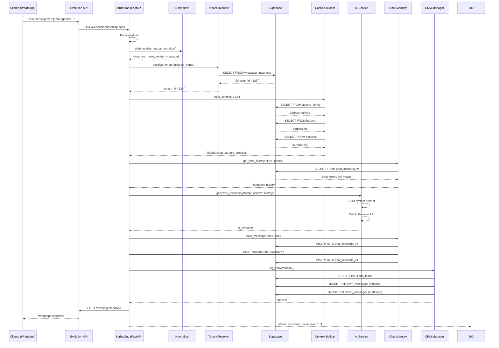

# Fluxo de Mensagens BarberZap - Diagramas

## 1. Diagrama de Arquitetura (High-Level)

```
┌─────────────────────────────────────────────────────────────────────────────┐
│                              CLIENTE WHATSAPP                               │
│                         (Usuário final da barbearia)                        │
│                                                                              │
│   João Silva envia: "Quero agendar um corte para sexta às 14h"             │
└────────────────────────────────────────┬────────────────────────────────────┘
                                         │
                                         │ HTTPS POST
                                         ▼
┌─────────────────────────────────────────────────────────────────────────────┐
│                         EVOLUTION API (WhatsApp)                            │
│                                                                              │
│   • Instância: barbearia_001                                               │
│   • Status: open (conectada)                                               │
│   • Recebe mensagem do WhatsApp                                             │
│   • Dispara webhook                                                        │
└────────────────────────────────────────┬────────────────────────────────────┘
                                         │
                                         │ POST /webhook/barberzap-saas
                                         │
                                         │ JSON Payload:
                                         │ {
                                         │   "event": "messages.upsert",
                                         │   "instance": {"instanceName": "barbearia_001"},
                                         │   "data": [{
                                         │     "key": {"remoteJid": "...", "fromMe": false},
                                         │     "message": {"conversation": "..."},
                                         │     "pushName": "João Silva"
                                         │   }]
                                         │ }
                                         ▼
┌─────────────────────────────────────────────────────────────────────────────┐
│                          BARBERZAP FASTAPI SERVER                           │
│                            (Python 3.12)                                    │
│                                                                              │
│   ╔════════════════════════════════════════════════════════════════════════╗ │
│   ║                        MAIN APPLICATION (main.py)                      ║ │
│   ║                                                                          ║ │
│   ║  • FastAPI v0.115.0                                                    ║ │
│   ║  • Middleware: Tenant, Logging, Security                               ║ │
│   ║  • Routers: Webhooks + Dashboard API                                    ║ │
│   ╚════════════════════════════════════════════════════════════════════════╝ │
│                                                                              │
│   ┌──────────────────────────────────────────────────────────────────────┐  │
│   │                      LAYER 1: WEBHOOKS                               │  │
│   │                                                                    │  │
│   │  webhook_barberzap(request)                                         │  │
│   │  ↓                                                                  │  │
│   │  WebhookNormalizer.normalize(payload)                               │  │
│   │    {instance_name, sender, message, client_name, event}             │  │
│   └──────────────────────────────────────┬───────────────────────────────┘  │
│                                          ↓                                  │
│   ┌──────────────────────────────────────────────────────────────────────┐  │
│   │                    LAYER 2: CORE (Multi-tenancy)                    │  │
│   │                                                                    │  │
│   │  resolve_tenant("barbearia_001") → tenant_id = "123"                │  │
│   │    ↓                                                                 │  │
│   │  build_context("123") → {barbershop, barbers, services}             │  │
│   └──────────────────────────────────────┬───────────────────────────────┘  │
│                                          ↓                                  │
│   ┌──────────────────────────────────────────────────────────────────────┐  │
│   │                    LAYER 3: AGENTS (AI)                             │  │
│   │                                                                    │  │
│   │  secretaria_universal.generate_response()                           │  │
│   │    ↓                                                                 │  │
│   │  get_chat_history("123", "5511999999999", limit=40)                 │  │
│   │    ↓                                                                 │  │
│   │  AIService.generate_response()                                       │  │
│   │    {response}                                                        │  │
│   └──────────────────────────────────────┬───────────────────────────────┘  │
│                                          ↓                                  │
│   ┌──────────────────────────────────────────────────────────────────────┐  │
│   │                    LAYER 4: CRM + MEMORY                            │  │
│   │                                                                    │  │
│   │  log_conversation()                                                 │  │
│   │    ↓                                                                 │  │
│   │  upsert_lead(phone, name) → lead_id                                 │  │
│   │    ↓                                                                 │  │
│   │  log_message(direction='inbound')                                   │  │
│   │  log_message(direction='outbound')                                  │  │
│   │    ↓                                                                 │  │
│   │  save_message(role='user')                                          │  │
│   │  save_message(role='assistant')                                     │  │
│   └──────────────────────────────────────┬───────────────────────────────┘  │
│                                          ↓                                  │
│   ┌──────────────────────────────────────────────────────────────────────┐  │
│   │                    LAYER 5: INTEGRATIONS                            │  │
│   │                                                                    │  │
│   │  evolution_send_message() → POST Evolution API                      │  │
│   └──────────────────────────────────────┬───────────────────────────────┘  │
└────────────────────────────────────────┼──────────────────────────────────┘
                                         │
                                         │ POST /message/sendText/barbearia_001
                                         │
                                         │ {number: "5511999999999", text: "Claro..."}
                                         ▼
┌─────────────────────────────────────────────────────────────────────────────┐
│                         EVOLUTION API (WhatsApp)                            │
│                                                                              │
│   • Envia mensagem para o número especificado                               │
│   • Delivery Confirmed                                                     │
└────────────────────────────────────────┬────────────────────────────────────┘
                                         │
                                         │ WhatsApp Message
                                         ▼
┌─────────────────────────────────────────────────────────────────────────────┐
│                              CLIENTE WHATSAPP                               │
│                                                                              │
│   João Silva recebe: "Claro, João! Vou verificar a disponibilidade...       │
└─────────────────────────────────────────────────────────────────────────────┘
```

---

## 2. Detalhamento da Pipeline de 6 Etapas

```
ETAPA 1: EVOLUTION API WEBHOOK
═══════════════════════════════════════════════════════════════════════════════

Cliente WhatsApp → Evolution API → BarberZap
      ↓                ↓                ↓
   "Quero..."    messages.upsert   /webhook/barberzap-saas
                     ↓                    ↓
                 payload = {
                   "event": "messages.upsert",
                   "instance": {"instanceName": "barbearia_001"},
                   "data": [{
                     "key": {
                       "remoteJid": "5511999999999@s.whatsapp.net",
                       "fromMe": false,
                       "id": "3EB0FAED6CC5D57E"
                     },
                     "message": {"conversation": "Quero agendar..."},
                     "pushName": "João Silva",
                     "timestamp": 1740315600
                   }]
                 }


ETAPA 2: WEBHOOK NORMALIZER
═══════════════════════════════════════════════════════════════════════════════

WebhookNormalizer.normalize(payload)
      ↓
{
  'instance_name': 'barbearia_001',     ← Extracted: instance.instanceName
  'sender': '5511999999999',            ← Extracted: key.remoteJid [@s.whatsapp.net]
  'message': 'Quero agendar...',        ← Extracted: message.conversation
  'client_name': 'João Silva',          ← Extracted: pushName
  'event': 'messages.upsert',           ← Extracted: event
  'raw_payload': {...},                 ← Original
  'is_valid': true,                     ← Valid check
  'should_process': true                ← (not fromMe, has message)
}

Validations:
  ✓ Content-Type = application/json
  ✓ event = messages.upsert
  ✓ fromMe = false (ignore own messages)
  ✓ message exists and not empty


ETAPA 3: TENANT RESOLUTION
═══════════════════════════════════════════════════════════════════════════════

resolve_tenant("barbearia_001")
      ↓
Query Supabase: whatsapp_instances
      ↓
SELECT * FROM whatsapp_instances
WHERE instance_name = 'barbearia_001'
  AND status = 'active'
      ↓
      Result: {
      id: 1,
      instance_name: 'barbearia_001',
      user_id: '123',
      status: 'active',
      ...
    }
      ↓
      Tenant ID: "123"
      ↓
  Tenant Resolution: ✅ SUCCESS


ETAPA 4: CONTEXT BUILDING
═══════════════════════════════════════════════════════════════════════════════

build_context("123")
      ↓
═══════════════════════════════════════════════════════════════════════════════
QUERY 1: agente_config
═══════════════════════════════════════════════════════════════════════════════

SELECT * FROM agente_config
WHERE user_id = '123'
      ↓
Result: {
  user_id: '123',
  nome_barbearia: 'Barbearia do João',
  endereco: 'Rua das Flores, 123',
  horarios: 'Seg-Sex 9h-19h, Sáb 9h-14h',
  nome_ia: 'Ana',
  saudacao: 'Olá! Como posso ajudar?',
  phone: '(11) 99999-9999',
  whatsapp: '5511999999999'
}

═══════════════════════════════════════════════════════════════════════════════
QUERY 2: barbers
═══════════════════════════════════════════════════════════════════════════════

SELECT * FROM barbers
WHERE user_id = '123'
  AND status = 'active'
      ↓
Result: [
  {
    id: 1,
    name: 'João Silva',
    status: 'active',
    specialties: ['Corte', 'Barba', 'Pigmentação']
  },
  {
    id: 2,
    name: 'Pedro Santos',
    status: 'active',
    specialties: ['Corte', 'Barba']
  }
]

═══════════════════════════════════════════════════════════════════════════════
QUERY 3: services
═══════════════════════════════════════════════════════════════════════════════

SELECT * FROM services
WHERE user_id = '123'
  AND status = 'active'
      ↓
Result: [
  {
    id: 1,
    name: 'Corte de Cabelo',
    description: 'Corte tradicional com máquina e tesoura',
    price: 35.00,
    duration: 30,
    status: 'active'
  },
  {
    id: 2,
    name: 'Barba',
    description: 'Barba modelada com toalha quente',
    price: 25.00,
    duration: 20,
    status: 'active'
  },
  {
    id: 3,
    name: 'Corte + Barba',
    description: 'Combo corte e barba',
    price: 50.00,
    duration: 50,
    status: 'active'
  }
]

═══════════════════════════════════════════════════════════════════════════════
CONTEXT BUILT:
═══════════════════════════════════════════════════════════════════════════════

{
  'barbershop': {
    'user_id': '123',
    'name': 'Barbearia do João',
    'address': 'Rua das Flores, 123',
    'hours': 'Seg-Sex 9h-19h, Sáb 9h-14h',
    'ai_name': 'Ana',
    'phone': '(11) 99999-9999',
    'whatsapp': '5511999999999'
  },
  'barbers': [
    {'id': 1, 'name': 'João Silva', 'status': 'active'},
    {'id': 2, 'name': 'Pedro Santos', 'status': 'active'}
  ],
  'services': [
    {'id': 1, 'name': 'Corte de Cabelo', 'price': 35.00, 'duration': 30},
    {'id': 2, 'name': 'Barba', 'price': 25.00, 'duration': 20},
    {'id': 3, 'name': 'Corte + Barba', 'price': 50.00, 'duration': 50}
  ]
}


ETAPA 5: SECRETÁRIA UNIVERSAL (IA)
═══════════════════════════════════════════════════════════════════════════════

generate_response(instance_name, phone, message, context)
      ↓
═══════════════════════════════════════════════════════════════════════════════
STEP 5.1: RETRIEVE CHAT HISTORY
═══════════════════════════════════════════════════════════════════════════════

get_chat_history(user_id='123', phone='5511999999999', limit=40)
      ↓
SELECT * FROM chat_memoria_v4
WHERE user_id = '123'
  AND phone = '5511999999999'
ORDER BY id DESC
LIMIT 40
      ↓
Result: [
  {id: 1, role: 'user', content: 'Olá!'},
  {id: 2, role: 'assistant', content: 'Oi! Como posso ajudar?'},
  ... (38 mais)
]

═══════════════════════════════════════════════════════════════════════════════
STEP 5.2: BUILD SYSTEM PROMPT
═══════════════════════════════════════════════════════════════════════════════

```
Você é Ana, a secretária virtual da Barbearia do João.

🎯 Sua Missão:
Atender clientes de forma NATURAL, EMPÁTICA e PROFISSIONAL

📍 Informações da Barbearia:
- Nome: Barbearia do João
- Endereço: Rua das Flores, 123
- Horário: Seg-Sex 9h-19h, Sáb 9h-14h
- WhatsApp: 5511999999999

🧔 Barbeiros disponíveis:
João Silva, Pedro Santos

💈 Serviços disponíveis:
• Corte de Cabelo (R$ 35.00)
• Barba (R$ 25.00)
• Corte + Barba (R$ 50.00)

💬 Diretrizes:
1. NATURAL e CONVERSACIONAL
2. EMPÁTICA e ATENCIOSA
3. CONFIRMA AGENDAMENTOS
4. PROFISSIONAL
5. CONCISA e DIRETA
```

═══════════════════════════════════════════════════════════════════════════════
STEP 5.3: AI GENERATION
═══════════════════════════════════════════════════════════════════════════════

AIService.generate_response(
  prompt='Quero agendar um corte para sexta às 14h',
  context={...},
  chat_history=[{role, content}, ...],
  temperature=0.7,
  max_tokens=500
)
      ↓
      POST to OpenRouter/Groq API
      ↓
      Response: "Claro, João! Vou verificar a disponibilidade para sexta-feira às 14h. Um momento, por favor..."

═══════════════════════════════════════════════════════════════════════════════
STEP 5.4: SAVE TO MEMORY
═══════════════════════════════════════════════════════════════════════════════

save_message(role='user', message='Quero agendar...')
save_message(role='assistant', message='Claro, João!...')


ETAPA 6: CRM LOGGING + SEND MESSAGE
═══════════════════════════════════════════════════════════════════════════════

log_conversation(
  user_id='123',
  phone='5511999999999',
  client_name='João Silva',
  inbound_message='Quero agendar...',
  outbound_message='Claro, João!...'
)
      ↓
═══════════════════════════════════════════════════════════════════════════════
CRM: UPSERT LEAD
═══════════════════════════════════════════════════════════════════════════════

INSERT INTO crm_leads (user_id, phone, name, status, source)
VALUES ('123', '5511999999999', 'João Silva', 'active', 'whatsapp')
ON CONFLICT (user_id, phone) DO UPDATE
SET name = 'João Silva', updated_at = NOW()
      ↓
      lead_id = 'uuid-123'

═══════════════════════════════════════════════════════════════════════════════
CRM: LOG MESSAGES
═══════════════════════════════════════════════════════════════════════════════

INSERT INTO crm_messages (lead_id, user_id, phone, direction, message)
VALUES ('uuid-123', '123', '5511999999999', 'inbound', 'Quero agendar...')

INSERT INTO crm_messages (lead_id, user_id, phone, direction, message)
VALUES ('uuid-123', '123', '5511999999999', 'outbound', 'Claro, João!...')

═══════════════════════════════════════════════════════════════════════════════
SEND VIA EVOLUTION API
═══════════════════════════════════════════════════════════════════════════════

POST https://evolution-api.com/message/sendText/barbearia_001
{
  "number": "5511999999999",
  "text": "Claro, João! Vou verificar a disponibilidade para sexta-feira às 14h. Um momento, por favor..."
}
      ↓
      Response: {message_id: "3EB0FAED6CC5D57E"}
      ↓
      ✅ SUCCESS


═══════════════════════════════════════════════════════════════════════════════
FINAL RESPONSE
═══════════════════════════════════════════════════════════════════════════════

{
  "status": "processed",
  "success": true,
  "tenant_id": "123",
  "instance_name": "barbearia_001",
  "phone": "5511999999999",
  "client_name": "João Silva",
  "message": "Quero agendar um corte para sexta às 14h",
  "response": "Claro, João! Vou verificar a disponibilidade para sexta-feira às 14h. Um momento, por favor...",
  "lead_updated": true,
  "lead_id": "uuid-123",
  "message_sent": true,
  "processing_time_ms": 245.67,
  "steps": {
    "normalizer": {"is_valid": true, "should_process": true},
    "tenant_resolution": {"success": true, "tenant_id": "123"},
    "context_building": {"success": true, "has_context": true},
    "secretaria": {"success": true, "ai_name": "Ana"},
    "crm_logging": {"success": true, "messages_logged": 2},
    "evolution_api": {"success": true, "message_id": "3EB0FAED6CC5D57E"}
  }
}
```

---

## 3. Diagrama de Relacionamento de Tabelas (ERD)

```
┌──────────────────────┐         ┌──────────────────────┐
│  whatsapp_instances  │         │   agente_config      │
├──────────────────────┤         ├──────────────────────┤
│ id (PK)              │         │ user_id (PK)         │◄───────────┐
│ instance_name (UNIQ) │         │ nome_barbearia       │            │
│ user_id (FK) ────────┼─────────┤►│ endereco             │            │
│ status               │         │ horarios             │            │
│ api_key              │         │ nome_ia              │            │
│ webhook_url          │         │ saudacao             │            │
│ created_at           │         │ phone                │            │
│ updated_at           │         │ whatsapp             │            │
└──────────────────────┘         └──────────────────────┘            │
        │                                                             │
        │ user_id                                                     │
        │                                                             │
        ▼                                                             │
┌──────────────────────┐         ┌──────────────────────┐             │
│      crm_leads       │         │      barbers         │             │
├──────────────────────┤         ├──────────────────────┤             │
│ id (PK, UUID)        │         │ id (PK, SERIAL)      │             │
│ user_id (FK) ────────┼─────────┤►user_id (FK)         │             │
│ phone (UNIQ)         │         │ name                 │             │
│ name                 │         │ status               │             │
│ status               │         │ specialties (ARR)    │             │
│ source               │         │ created_at           │             │
│ metadata (JSONB)     │         └──────────────────────┘             │
│ created_at           │                                             │
│ updated_at           │                                             │
└──────────────────────┘                                             │
        │                                                             │
        │ (1:N)                                                       │
        │                                                             │
        ▼                                                             │
┌──────────────────────┐         ┌──────────────────────┐             │
│    crm_messages      │         │     services          │             │
├──────────────────────┤         ├──────────────────────┤             │
│ id (PK, UUID)        │         │ id (PK, SERIAL)      │             │
│ lead_id (FK) ────────┼─────────│►user_id (FK)         │             │
│ user_id              │         │ name                 │             │
│ phone                │         │ description          │             │
│ direction            │         │ price                │             │
│ message              │         │ duration             │             │
│ response             │         │ status               │             │
│ metadata (JSONB)     │         │ created_at           │             │
│ created_at           │         └──────────────────────┘             │
└──────────────────────┘                                             │
                                                                      │
┌──────────────────────┐                                             │
│  chat_memoria_v4     │                                             │
├──────────────────────┤                                             │
│ id (PK, SERIAL)      │                                             │
│ user_id (FK) ────────┼─────────────────────────────────────────────┘
│ phone                │
│ role                 │
│ content              │
│ created_at           │
└──────────────────────┘

LEGENDA:
  (PK)  = Primary Key
  (FK)  = Foreign Key
  (UNIQ)= Unique Constraint
  (ARR) = Array Type
  (JSONB)= JSON Binary Column
```

---

## 4. Diagrama de Multi-Tenancy

```
┌─────────────────────────────────────────────────────────────────────────┐
│                        EVOLUTION API SERVER                            │
│                                                                         │
│  ┌──────────────┐  ┌──────────────┐  ┌──────────────┐                 │
│  │   Instance   │  │   Instance   │  │   Instance   │                 │
│  │  barbearia_  │  │  barbearia_  │  │  barbearia_  │                 │
│  │     001      │  │     002      │  │     003      │                 │
│  │              │  │              │  │              │                 │
│  │ Connected    │  │ Connected    │  │ Connected    │                 │
│  │ to WhatsApp  │  │ to WhatsApp  │  │ to WhatsApp  │                 │
│  └──────┬───────┘  └──────┬───────┘  └──────┬───────┘                 │
└─────────┼──────────────────┼──────────────────┼───────────────────────┘
          │                  │                  │
          │                  │                  │
          ▼                  ▼                  ▼
┌─────────────────────────────────────────────────────────────────────────┐
│                    BARBERZAP BACKEND (FastAPI)                         │
│                                                                         │
│    POST /webhook/barberzap-saas instance_name parameter                │
│                         │                                               │
│         ┌───────────────┼───────────────┐                            │
│         ▼               ▼               ▼                            │
│    barbearia_001    barbearia_002    barbearia_003                     │
│         │               │               │                            │
│         ▼               ▼               ▼                            │
│  ┌─────────────┐  ┌─────────────┐  ┌─────────────┐                    │
│  │ whatsapp_   │  │ whatsapp_   │  │ whatsapp_   │                    │
│  │ instances   │  │ instances   │  │ instances   │                    │
│  └──────┬──────┘  └──────┬──────┘  └──────┬──────┘                    │
└─────────┼──────────────────┼──────────────────┼───────────────────────┘
          │                  │                  │
          │ Resolve:         │                  │
          ▼                  ▼                  ▼
      tenant_id          tenant_id          tenant_id
       = "123"            = "456"            = "789"
          │                  │                  │
          ▼                  ▼                  ▼
┌─────────────────────────────────────────────────────────────────────────┐
│                       SUPABASE DATABASE                                │
│                                                                         │
│  ┌─────────────────────────────────────────────────────────────────┐  │
│  │                        agente_config                            │  │
│  ├─────────────────────────────────────────────────────────────────┤  │
│  │  user_id="123"  │  user_id="456"  │  user_id="789"             │  │
│  │  Barbearia      │  Barbearia      │  Barbearia                   │  │
│  │  Central        │  Sul            │  Norte                       │  │
│  │  Ana (IA)       │  Maria (IA)     │  José (IA)                   │  │
│  └─────────────────┴─────────────────┴─────────────────────────────┘  │
│                                                                         │
│  ┌─────────────────────────────────────────────────────────────────┐  │
│  │                           barbers                               │  │
│  ├─────────────────────────────────────────────────────────────────┤  │
│  │  user_id="123": João, Pedro                                     │  │
│  │  user_id="456": Carlos, André                                    │  │
│  │  user_id="789": Rafael, Lucas                                    │  │
│  └─────────────────────────────────────────────────────────────────┘  │
│                                                                         │
│  ┌─────────────────────────────────────────────────────────────────┐  │
│  │                          services                               │  │
│  ├─────────────────────────────────────────────────────────────────┤  │
│  │  user_id="123": Corte R$35, Barba R$25                          │  │
│  │  user_id="456": Corte R$40, Barba R$30                          │  │
│  │  user_id="789": Corte R$38, Barba R$28                          │  │
│  └─────────────────────────────────────────────────────────────────┘  │
│                                                                         │
│  ┌─────────────────────────────────────────────────────────────────┐  │
│  │                           CRM                                    │  │
│  ├─────────────────────────────────────────────────────────────────┤  │
│  │  user_id="123": leads, messages (isolados)                       │  │
│  │  user_id="456": leads, messages (isolados)                       │  │
│  │  user_id="789": leads, messages (isolados)                       │  │
│  └─────────────────────────────────────────────────────────────────┘  │
└─────────────────────────────────────────────────────────────────────────┘

EXEMPLO DE ISOLAMENTO:
──────────────────────────────────────────────────────────────────────────

Tenant 123 (Barbearia Central):
  • Instance: barbearia_001
  • Leads: (5511999999999, João Silva), (5511999999988, Maria)
  • Messages: Isolados apenas para contatos deste tenant
  • Context: Barbearia Central, Ana (IA), João/Pedro (barbeiros)

Tenant 456 (Barbearia Sul):
  • Instance: barbearia_002
  • Leads: (5511888888888, Carlos), (5511888888777, Fernanda)
  • Messages: Isolados apenas para contatos deste tenant
  • Context: Barbearia Sul, Maria (IA), Carlos/André (barbeiros)

Tenant 789 (Barbearia Norte):
  • Instance: barbearia_003
  • Leads: (5511777777777, Rafael), (5511777777666, Juliana)
  • Messages: Isolados apenas para contatos deste tenant
  • Context: Barbearia Norte, José (IA), Rafael/Lucas (barbeiros)
```

---

## 5. Diagrama de Sequência Completo (Mermaid)



---

**Fim do Documento de Diagramas**
